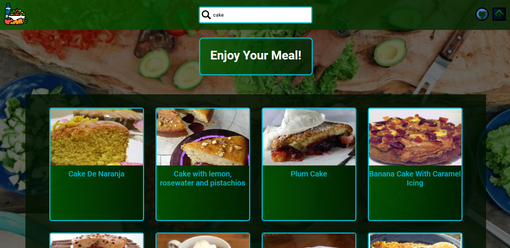

# Vegetarian App
This is the project I made for the start2impact React path.

## Table of Content
* [Description](#Description)
* [Installation](#Installation)
* [Built](#Built)
* [Dependencies](#Dependencies)
* [Author](#Author)
* [License](#License)

## Description
I built this application using the spoonculator [API](https://spoonacular.com/food-api/docs). From here you can search for all the vegetarian recipes you want from a vast catalog where you can also find their nutritional values. I made the project using with [React](https://it.reactjs.org/) framework by configuring the project with create-react-app. For state management I configured redux toolkit with with createSlice and createAsyncThunk, while for routing I installed react-rourter-dom (v6). In addition to these dependencies I have also used others that you can find [below](#dependencies) or in the [package.json](https://github.com/GiovanniValastro/vegetarian-app/blob/master/package.json) file.


[click to watch](https://gv-vegetarian-app.netlify.app/)

## Installation

* to clone the repository type the command:

```
git clone https://github.com/GiovanniValastro/vegetarian-app
  ```

* After then install the dependencies shown in the file [package.json](https://github.com/GiovanniValastro/vegetarian-app/blob/master/package.json) or [below](#dependencies) with npm:

```
npm i dependencies
```


* Finally to use the application subscribe to the spoonacular [site](https://spoonacular.com/food-api/console#Dashboard) to get the API key. Once done, create an .env file and type:

```
REACT_APP_APY_KEY= your key   
```

## Built
* HTML
* Sass
* Javascript
* React

## Dependencies
* [@reduxjs/toolkit: 1.8.2](https://www.npmjs.com/package/@reduxjs/toolkit)
* [axios: 0.27.2](https://www.npmjs.com/package/axios)
* [react-loader-spinner: 5.1.5](https://www.npmjs.com/package/react-loader-spinner)
* [react-redux: 8.0.2](https://www.npmjs.com/package/react-redux)
* [react-router-dom: 6.3.0](https://www.npmjs.com/package/react-router-dom)
* [sass: 1.52.1](https://www.npmjs.com/package/sass)
 
## Author
For more information visit [my website](https://giovannivalastro.github.io/).

## License
Distributed under the MIT License. See [LICENSE.txt](https://github.com/GiovanniValastro/vegetarian-app/blob/master/LICENSE) for more information.
